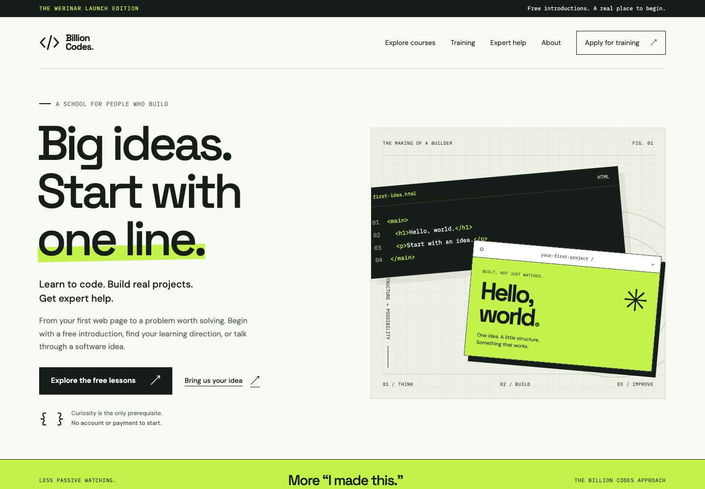

# Billion Codes: launch frontend

An honest, public launch for learning and software enquiries. React + Vite + TypeScript; production assets build to `dist/`. No paid catalogue, checkout, learner account, certificate, referral programme or community controls are simulated.



## Scope

- Editorial, responsive public school site with locally hosted Space Grotesk, DM Sans and IBM Plex Mono fonts. No external font or image request is required.
- Original built-in HTML primer: two authored text lessons and one deterministic multiple-choice practice activity. No learner code evaluation or HTML injection.
- Live catalogue and text lesson reader using `GET /api/v1/catalog`. Failure and malformed responses show an explanation and an explicit retry. No fallback response is fabricated. The independently labelled built-in primer is bundled source content, not a cached server catalogue. Offline page reload/installation is not promised.
- Search and level filter derive their values from the actual API catalogue. Course bodies are rendered as text; source examples preserve line breaks and wrap on phones.
- Training applications and business software / mentorship / code-review enquiries use the agreed v1 contracts. Success requires a confirmed response, not an optimistic placeholder.
- About, verified public contact, and plain-language privacy/launch terms. Dates, prices, locations, response times, testimonials and statistics are not invented.
- The frontend does not edit or depend on the backend-owned `public/admin.html` interface.

## Local development

Node 22.16+ is recommended. Install exactly from the lockfile:

```sh
npm ci
npm run build
npm run db:migrate:local
npm run preview:cloudflare
```

The combined local Worker serves the built site at `http://localhost:8788`. The Worker requires a local `SECURITY_SALT` of at least 32 characters; follow the backend's setup notes for secrets. Do not commit secrets or embed them in browser code. The preview script overrides only the allowed local origins, not production settings.

For frontend hot reload, run `npm run dev` in a second terminal. Vite listens on `http://127.0.0.1:5174` and proxies `/api` to port 8788. Loading the frontend without the API is supported as a visible catalogue/request failure state, not as a mock server.

The deployment script is `npm run deploy` (`npm run build && wrangler deploy`); deployment, account, real D1 ID, domains and secrets remain the parent/operator's responsibility. No deployment or git operation was performed by the frontend worker.

## CI handoff

```sh
npm ci
npx playwright install --with-deps chromium
npm run build
npm run test:backend
npm run test:frontend
```

- `test:backend`: `node --test worker/tests/backend.test.mjs` (backend-owned local Miniflare/workerd/D1 integration tests).
- `test:frontend`: `playwright test --config tests/frontend/playwright.config.ts`.
- Frontend tests start Vite themselves. Most UI-state tests use the actual authored `worker/catalog.js` in a mocked response; success/error fixtures are test-only.
- `integration.spec.ts` separately serves the actual `dist/` build through a loopback-only HTTP bridge. Every API call is forwarded to the backend's real Miniflare/workerd/D1 harness, with no API response mocks. Both forms submit through the browser at each viewport, receive real 201 responses, and verify their receipt IDs and values against D1 rows. Production credentials and the real public domain are never contacted.
- The test suite uses 1440x1000 and 390x844 Chromium viewports. It checks public pages with axe WCAG A/AA rules, overflow, catalogue errors/malformed data, plain-text lesson rendering, consent and form validation, server errors, payload fields, retained drafts, retry key reuse/rotation, deterministic practice, blocked browser storage, keyboard navigation and the mobile menu.
- To use an existing local Chrome instead of a downloaded test browser, set `PLAYWRIGHT_CHROMIUM_EXECUTABLE_PATH` to its executable. This is optional and not needed in normal CI.
- With `npm run preview:cloudflare` running on port 8788, `npm run test:assets:local` separately checks actual Cloudflare-served CSP headers and browser rendering on every public route without CSP violations or external asset requests. It submits no forms and needs no production credentials.
- Browser traces/failure screenshots go to `tests/frontend/results/`; exclude these from git. The four intentional showcase screenshots in `tests/frontend/artifacts/` should remain available to the README and portfolio.

## State and privacy

Drafts stay in JavaScript memory across in-site navigation. They survive recoverable form errors, but not a page reload or closed tab. Personal form values are never put in localStorage/sessionStorage. Identical retries preserve the UUID Idempotency-Key; any field edit rotates it for the next request. Optional empty fields are omitted. Controls are disabled during submission, and errors link to labelled fields.

Reading progress alone uses localStorage, keyed by course ID and a frontend version. The UI explicitly says device-only, no sync, assessment or certificate. It supports reset and catches unavailable browser storage.

Launch privacy text accurately discloses that a fixed automatic retention period has not yet been published. The operator still needs to choose and implement the production retention policy with the backend; do not silently claim a deletion schedule. Consent is for storing/reviewing/responding to this enquiry, not marketing. Both forms warn against confidential material and offer the verified `mailto:jhardeyemor@gmail.com` fallback.

## Frontend paths

- `src/main.tsx`: public navigation, page views, catalogue, text reader, practice and local progress.
- `src/EnquiryForm.tsx`: shared accessible form engine, validation, ephemeral drafts, idempotency and server states.
- `src/api.ts`: timed JSON requests and runtime catalogue shape checks.
- `src/intro.ts`: independently labelled authored HTML primer.
- `src/styles.css`: responsive visual system, focus states, reduced motion and print styles.
- `tests/frontend/`: configuration, browser checks and verified screenshots.
- `public/favicon.svg`: original code-mark favicon. No external imagery is required.
- `public/_headers`: production static-asset CSP restricted to self-hosted scripts, styles, fonts, images and API connections, with no inline-script/eval exception. API/admin responses retain their separate Worker policies. Self-hosted font licenses are in `public/font-licenses/`.

Hash routes keep the launch compatible with static assets: `/#/courses`, `/#/learn/first-web-page`, `/#/training`, `/#/services`, `/#/about`, `/#/policies`. Unknown paths inside the app display an explicit not-found state. Page title, focus and scroll position update after navigation.

## Screenshots

- Desktop hero: `tests/frontend/artifacts/desktop-1440-hero.png`
- Desktop full page: `tests/frontend/artifacts/desktop-1440-full.png`
- Mobile hero: `tests/frontend/artifacts/mobile-390-hero.png`
- Mobile full page: `tests/frontend/artifacts/mobile-390-full.png`

These are actual browser captures of the implemented page, not concept mockups. The homepage uses no invented API data. They can be used for the public repository's project preview after the parent finishes repository/deployment setup.

## Verified handoff

11 September 2026: production build and strict TypeScript check pass. The frontend suite passes 28/28 tests using installed Chrome at 1440 and 390 pixels, including the two real Worker/D1 browser integration tests. The finalized backend suite passes 30/30 tests. The separate local Cloudflare asset test also passes: the real static response has the intended CSP, and eight public routes render without CSP violations, external asset requests or page errors. Public-page axe WCAG A/AA scans report no violations in the checked states, and every checked route stays within the viewport. Automated checks do not replace a complete assistive-technology audit. Four final screenshots were regenerated after the last visual adjustment.
